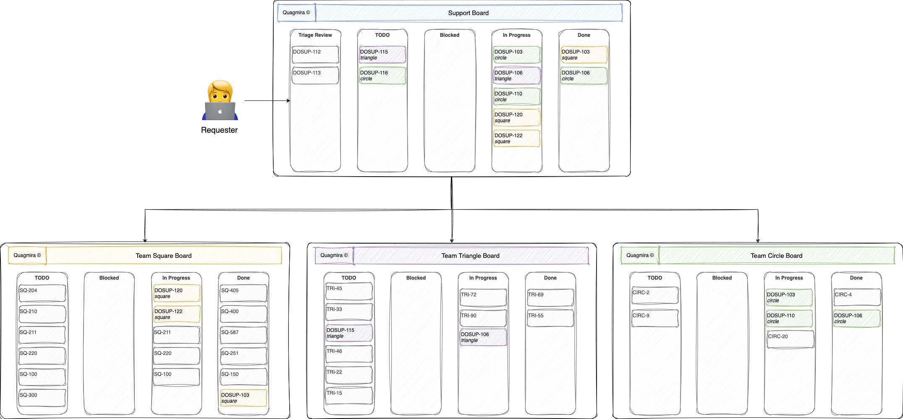

# DevOps Support Blog

DevOps practitioners often find themselves immersed in a deluge of support demands owing to the expansive nature of their work. The way support issues are managed often varies on the DevOps team type/format. 

Whether you approve or not, DevOps is commonly implemented as an established team, not just a set of philosophies, practices and tools within an organisation. [DevOps Topologies](https://web.devopstopologies.com/) is the best effort I have seen to formalise how "DevOps" is often implemented in reality.

In this post, I will discuss the best attempt I have seen to provide a "DevOps support function" that kept both reporters and DevOps practitioners happy.

### Assumptions

Although not a rule of thumb, the following is being assumed:

{: style="height:50%;width:50%;display:block;margin-left:auto;margin-right:auto"}

✅ You have 10+ "DevOps practitioners" in your team

✅ You have 50+ Developers/Testers who use your tooling with multiple daily support requests

✅ You have an issue traker (e.g. Trello, Jira...)

✅ Your users can report issues directly and can view updates/comments

✅ You have the ability to communicate with your team daily (e.g. channels/threads, video call...)

✅ Your team members accept that they have an occasional support function to fulfil and do so with empathy

If you can eventually answer yes to all the above then...

### Establish a Daily Support Triage

This is a meeting has the following criteria:

- A representative from each DevOps team or alternatively someone with enough team exposure to know the abilities of a given team
- Someone with visibility of upcoming work (the team have a non-support function too!)
- An up-to-date view/board of all support tickets (newly created, ongoing and done)
- Enough seniority/confidence to question/reject any given ticket
- A nominated lead for the meeting (i.e. Engineering Manager, round-robin attendees...)
- A timebox of 15 minutes (max!) for the entire meeting
- It **MUST** occur before all team daily stand-ups 
- A coffee is required 

### Setup a Support Board

Your support view/board should look similar to the following. Don't be overwhelmed by board/view creation...it's easier to think of them as a database query where the data is the tickets:

The definition of each column/swimlane is as follows:

- Triage Review - these ticket have been raised inbetween the previous daily triage call and now. It is the default ticket state/position when it has been created
- TODO - tickets that have been approved during the triage process and assigned to the relevant team based on some heuristic (e.g round-robbin, A/B team...)
- Blocked - tickets that have blocked with an explanation provided in the comments section
- In Progress - tickets currently being looked at by members of the DevOps team
- Done - Yay! 🥳

With the above in mind, the ticket transitions are as follows...

### Protect the Team!
The triage is the primary way to filter support requests and acts as the first line of defense.

This filtration protects the team from:

- Low priority work - everyone always thinks their work is the most important
- Invalid work - sometimes the requester is just wrong
- Poor requirements - if it can't be easily understood, reject it!
- Duplicate work - the attendees of the triage are the best people to identify duplicate effort

It's vital that all members of the team feel comfortable rejecting a ticket. Putting it on a never ending backlog rarely the answer.
